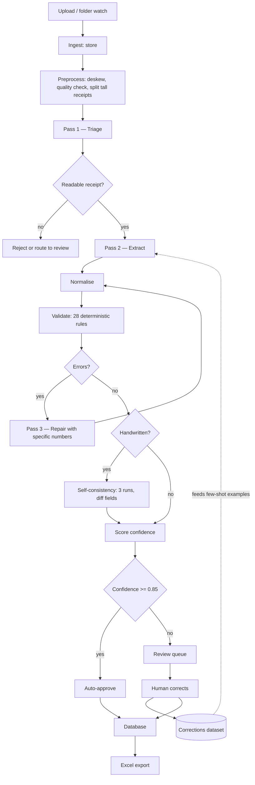

<<<<<<< HEAD
# Receipt Digitization System

Turn photographs of receipts — from any merchant, printed or handwritten — into
structured data and an Excel workbook, using a Vision-Language Model.

This document explains the whole project: what the problem actually is, the
reasoning behind the design, what has been built, and where to start. Read this
first. It points to everything else.

---

## Contents

1. [The problem](#1-the-problem)
2. [Five things that turned out to matter](#2-five-things-that-turned-out-to-matter)
3. [How the system works](#3-how-the-system-works)
4. [What exists right now](#4-what-exists-right-now)
5. [Design decisions and why](#5-design-decisions-and-why)
6. [Two bugs worth learning from](#6-two-bugs-worth-learning-from)
7. [Data: where it comes from](#7-data-where-it-comes-from)
8. [Status: built vs. remaining](#8-status-built-vs-remaining)
9. [How to start](#9-how-to-start)
10. [Which file to read for what](#10-which-file-to-read-for-what)

---

## 1. The problem

**Input:** photos of receipts. JPEG, PNG, HEIC, PDF. Arbitrary merchants, so no
template per merchant is possible. Real capture conditions — phone camera,
indoor light, glare, folds, faded thermal ink, partial crops. Some receipts are
**handwritten**.

**Output:** normalised records in a database, plus an `.xlsx` workbook with a
receipt-level sheet and a line-item-level sheet.

**Constraint:** it has to be trustworthy enough to feed accounting. That last
word changes everything about the design, as the next section explains.

---

## 2. Five things that turned out to matter

These are the load-bearing insights. Everything in the codebase follows from
them.

### OCR is not the hard part anymore

Vision-Language Models now beat dedicated OCR engines on real-world documents,
with substantially lower character error rates on noisy scans and receipts. For
handwriting they are effectively the only practical option — traditional OCR
engines simply do not work on it.

So the difficulty has moved. It is no longer "can the machine read this?" It is
**"can I turn arbitrary layouts into one consistent schema, and can I tell when
I got it wrong?"** The architecture is built around that second question.

### A wrong number is much worse than a missing number

This is the single most important principle in the system, and it is stated
explicitly in the model's system prompt.

A VLM asked to read an ambiguous handwritten digit will not tell you it is
unsure. It produces the most probable token and moves on — a `1` that could be
a `7` gets resolved silently, with the same confident tone as everything else.
In an accounting pipeline that is worse than useless.

So the prompt says, in as many ways as it can: *null is a correct answer, you
are not penalised for nulls, you are heavily penalised for confident wrong
values.* And the rest of the pipeline is built to catch what slips through.

### The metric is auto-approval precision, not extraction accuracy

A system that extracts 95% of fields correctly but cannot tell you *which* 5%
are wrong is unusable for accounting — every receipt still needs checking, so
you have automated nothing.

A system that extracts 85% correctly and reliably flags every uncertain one is
production-ready. You review the flagged ones and trust the rest.

So the metric that governs everything is: **of the receipts the system
auto-approves without human review, what fraction are fully correct?** Target
≥99%. Then, subject to holding that, maximise how many get auto-approved.

Those two numbers pull against each other, and calibrating the threshold
between them is the highest-value hour of work in the project.

### Validation is deterministic code, not another model call

The pipeline's ability to catch its own errors comes from ordinary arithmetic:

- Do the line items sum to the subtotal?
- Does `qty × unit_price` equal each line total?
- Does `subtotal + tax − discount` equal the total?
- Is the date real, and not in the future?

28 such rules, all pure functions with no I/O. When they fail, the specific
numbers go back to the model in a targeted repair prompt. This layer costs
nothing to run, never hallucinates, and produces the largest single accuracy
jump in the project.

### Public data can benchmark. Only your own data can calibrate.

Public receipt datasets exist and are useful for comparing model A to model B.
None of them contain your merchants, your capture conditions, your currency, or
your tax conventions. And **no public handwritten receipt dataset exists at
all.**

So the first task in the build order is not code. It is collecting and
hand-labelling 50–100 of your own receipts. Every subsequent decision — model
choice, prompt wording, where the confidence threshold sits — is settled
against that set. Without it you are guessing.

---

## 3. How the system works



> **Duplicates are allowed.** The pipeline does **not** reject a re-uploaded
> image or a repeat of the same purchase. A user who forgets a receipt was
> already processed and uploads it again gets a second, independent receipt that
> is extracted and routed on its own confidence. The trade: an accidental
> re-upload costs a full extraction (the perceptual hash no longer
> short-circuits the model call), and the ledger/export may hold two rows for
> one purchase. `image_phash` is still stored on every row, so image dedupe
> could be reinstated later without a backfill.

### The three model passes, explained

**Pass 1 — Triage.** A cheap classification call on a small model. Is this a
receipt at all? Printed or handwritten? How legible? Roughly how many line
items? It returns **no amounts**. Its job is to reject garbage before you pay
for extraction, and to select which prompt variant pass 2 uses.

**Pass 2 — Extract.** The real call, on the strong model. The receipt image
plus a schema-constrained prompt. If the merchant is recognised, up to two
verified prior extractions from that same merchant are injected as examples.

**Pass 3 — Repair.** Fires only when validation finds errors. This is the
clever part: the model gets its own previous output *plus the specific numbers
that do not reconcile*:

```
[R021] Line item 1 'CHKN BRST 1KG': qty(2) x unit_price(125) = 250,
       but line_total was extracted as 185.
[R022] Totals equation failed: subtotal(847.50) + tax(101.70) - discount(0)
       = 949.20, but total was extracted as 847.50 (difference 101.70).
```

A generic "please check your math" does very little. Naming the exact figures
is what makes this pass work.

One rule in the repair prompt is subtle and important: *do not alter numbers to
make the arithmetic work.* Real receipts genuinely fail to add up — cash
rounding, manual price overrides, promos printed outside the subtotal. The
model is told to keep the printed values and set a flag instead.

### Self-consistency for handwriting

Handwritten receipts get extracted **three times** at a non-zero temperature,
and the results are compared field by field. Fields that agree across all runs
are high-confidence; fields that disagree are flagged, and a field with no
majority is set to null.

This turns the model's non-determinism from an annoyance into a free
uncertainty signal. It is far more honest than asking the model how confident
it is — asked directly, it will tell you it is confident about that ambiguous
`1`.

### Confidence and routing

Every signal folds into one number: validation findings, legibility,
handwritten or not, missing critical fields, fields the model itself flagged as
ambiguous, consistency disagreement, and a small bonus for a well-known
merchant. Above the threshold, auto-approve. Below, route to review with a
priority and a reason.

**Nothing is ever silently dropped.** Every receipt reaches a terminal state.
If any pipeline stage throws, the receipt is marked `needs_review` with the
failing stage as the reason.

---

## 4. What exists right now

**The suite passes with no network access required** — a fake client replays
scripted responses, so the whole pipeline can be exercised offline at zero API
cost. No count here: run `python -m pytest`.

*(This paragraph opened "Roughly 6,100 lines across specs, implementation, and
tests. 103 tests pass" until 2026-08-24. No replacement counts here either:
`git ls-files` answers the first and `python -m pytest` the second, at whichever
commit you are reading. Both move every milestone and this sentence never moved
with them.)*

### Documents

| File | Lines | What it is |
|---|---|---|
| `RECEIPT_SYSTEM_SPEC.md` | 1,625 | The build spec. 19 sections: architecture, seven-table data model, all prompt text, the 28-rule catalogue, confidence scoring, Excel layout, a ~90-function inventory, milestones M0–M7, eval metrics |
| `VLM_AND_DATA.md` | 383 | Model layer walkthrough, hosted vs. self-hosted, runtime call sequence, cost budget, dataset sourcing, the handwriting gap, bootstrapping plan |
| `IMPLEMENTATION_PLAN.md` | - | Task-level build plan: 10 phases, 34 tasks across frontend, backend, database, and algorithm polish, with the code review's fixes folded in |
| `README.md` | — | This file |

### Implementation

| File | Lines | Purpose |
|---|---|---|
| **`extract/`** | | |
| `schema.py` | 210 | The Pydantic contract. Money is always `Decimal` |
| `prompts.py` | 327 | Every prompt: system, triage, extraction, handwriting addendum, repair. Plus `prompt_bundle_hash()` for versioning |
| `json_io.py` | 210 | Tool-schema preparation and tolerant response parsing |
| `paths.py` | 95 | Dotted-path flatten/unflatten (`line_items[2].qty`) |
| `extractor.py` | 377 | The three-pass orchestrator, repair loop, self-consistency |
| `clients/base.py` | 210 | `VLMClient` interface, retry with backoff, cost accounting, response cache |
| `clients/anthropic_client.py` | 157 | Hosted, tool-use structured output |
| `clients/openai_compat.py` | 167 | vLLM / Ollama / any OpenAI-format endpoint |
| `clients/fake.py` | 78 | Scripted responses, no network |
| **`validate/`** | | |
| `rules.py` | 1,059 | All 28 rules |
| `report.py` | 102 | `Finding`, `ValidationReport`, repair-prompt rendering |
| `context.py` | 133 | Tunable config, loadable from YAML |
| `validator.py` | 72 | Rule runner. Never mutates, never raises, deterministic |
| **`config/`** | | |
| `rules.yaml` | 43 | Tolerances and thresholds, tunable without a code change |
| **`tests/`** | | |
| `test_rules.py` | 536 | Every rule fires when it should — and stays silent when it should not |
| `test_extractor.py` | 334 | Schema prep, parsing, repair loop, consistency, retry, caching |

---

## 5. Design decisions and why

A log of the choices that are easy to get wrong, and the reasoning behind each.

### Structured output via tool-use, not "reply in JSON"

The extraction call defines a tool whose `input_schema` is the JSON Schema of
the extraction model, and forces the model to call it. The provider constrains
generation to the schema, so malformed output becomes rare rather than a
routine failure you build retries around.

This required fixing two things Pydantic does that break tool schemas —
`$ref`/`$defs` references that some providers silently ignore, and `Decimal`
fields rendering as `number | string-with-regex | null`, where that string
branch actively invites `"949.20"` as a string. Both are handled in
`json_io.py`, both have tests, because both will silently reappear on a
dependency upgrade.

### The repair loop keeps the *best* attempt, not the last

Repair passes sometimes make things worse — on poor-legibility images the model
starts second-guessing readings that were correct. Attempts are ranked
`(error_count, warn_count, null_count)` and the winner is kept. There is a test
where the repair returns something strictly worse and the original survives.

### An unparseable response triggers a re-extract, not a repair

Asking a model to correct an object it never produced wastes a call and usually
returns the same broken output.

### Warnings do not trigger a repair; only errors do

A repair costs a full API call. A missing merchant name is not something a
second pass reliably fixes, so it lowers confidence instead.

### Few-shot images go first, the target receipt goes last

Whichever image sits closest to the instruction text is the one the model
treats as the subject. Get the order backwards and it extracts your example.

### Consistency runs are never cached

A cache hit would return the same answer three times and manufacture perfect
agreement, destroying the exact signal the mechanism exists to produce. The
cache refuses anything with a non-zero temperature.

### Excel is an output format, never the source of truth

All exports read from the database. Using a spreadsheet as the store means
fighting concurrency, duplicate detection, and schema changes forever.

### `Decimal` everywhere in the money path

A single `float` produces tolerance failures that look like model errors and
costs hours to track down. The spec calls for a test that walks the schema and
asserts no field is typed `float`.

### Merchant hints always end with "trust the image"

Stored per-merchant hints are injected into the prompt, followed by: *use these
as guidance only; if what you see contradicts them, trust the image.* Without
that line, hints become a hallucination source the day a merchant changes their
receipt format.

### Rule IDs are stable and never renumbered

They are stored in the database and referenced in the review UI.

---

## 6. Two bugs worth learning from

Both were found by writing tests, and both are instructive.

### The tolerance function was quietly excusing misreads

The original spec used a relative tolerance of 0.5% when comparing money
values. That sounds reasonable until you compute what it grants:

```
total     100.00  ->  tolerance +/- 0.50
total     949.20  ->  tolerance +/- 4.75
total  12,500.00  ->  tolerance +/- 62.50
```

On a 949.20 receipt, a misread of `945.20` would **pass validation**. The rule
designed to catch misreads was excusing them.

The mistake was conceptual: rounding error is bounded in *cents*, not
proportional to magnitude. Fixed to `rel = 0.0002` (±0.19 on that total), with
a regression test pinning `949.20 vs 945.20` as a failure. Where error genuinely
does accumulate — summing forty line items — that is handled explicitly by
scaling the floor with line count, not by inflating the relative term.

**The lesson:** a tolerance that feels safe is often a tolerance that has
stopped doing its job. Compute what yours actually grants.

### A "reasonable" rule that would have deleted real products

Rule R052 rejects summary rows (`SUBTOTAL`, `VAT`, `CHANGE`) that the model
sometimes emits as line items. The obvious implementation is a substring match.

That would silently delete `TOTAL WINE CO MERLOT`, `CASH CARD TOPUP`, and
`VATANA BEANS` — all real products. The implementation uses exact match after
normalisation, with parametrised tests pinning those exact cases.

**The lesson:** for every rule, the test that matters most is not "does it fire
when it should" but **"does it stay silent when it should."** A rule that fires
spuriously pollutes the repair prompt and costs accuracy.

---

## 7. Data: where it comes from

Three different jobs, three different sources.

**Smoke testing** — does the pipeline run end to end? Any receipt images.

**Benchmarking** — how does model A compare to model B? Public datasets:

- **CORD** — 1,000 Indonesian receipts, 30 entity types, box-level annotations.
  The best public fit, and the only well-known one with real line-item
  structure.
- **MC-OCR** — 2,436 Vietnamese receipts, **mobile-captured**, so the most
  realistic capture conditions available.
- **SROIE** — 1,000 receipts but only four header fields. No line items.
- Others (WildReceipt, UIT-MLReceipts, ReceiptSense, FATURA) cover layout
  variety, other scripts, and synthetic layouts.

**Check the licence before building a product on any of them.** Several were
released under research-only competition terms.

**Calibration** — where does the confidence threshold go? **Your own receipts,
and nothing else.** No public dataset contains your merchants or your capture
conditions.

**Handwriting has no public dataset at all.** IAM is English prose on forms;
FUNSD is forms. Neither resembles a receipt's structure or numeric density. You
must collect 100–150 handwritten receipts yourself — and sample *writers*, not
merchants, because writer-to-writer variation is the larger factor.

**The dataset that ends up mattering most is your own `corrections` table.**
Every human edit in the review queue writes a row. Within months this is worth
more than every public dataset combined, because it is precisely your failure
modes. It pays out in three stages: merchant hints (immediately), verified
few-shot examples (weeks), fine-tuning (months, and only as a cost
optimisation).

---

## 8. Status: built vs. remaining

> The full task-level breakdown of everything remaining, across frontend, backend, database, and algorithm polish, lives in `IMPLEMENTATION_PLAN.md` (dependency-ordered phases mapped to milestones M0-M7).

### Built and tested

- Extraction schema, all prompts, tool-schema preparation, response parsing
- All 28 validation rules, the runner, tunable config
- Three-pass orchestrator with repair loop and best-attempt selection
- Self-consistency voting for handwriting
- Two real client implementations plus a fake for offline work
- Retry with backoff, cost accounting, response caching
- A test suite that runs entirely offline

### Specified but not yet written

Full signatures for all of these are in spec §14.

- `ingest/` — upload, PDF rasterising, perceptual hashing (stored, not used to reject — duplicates are allowed), blob storage
- `preprocess/` — deskew, bounds detection, quality assessment, tall-receipt splitting
- `normalize/` — date, number, currency, and text canonicalisation
- `score/` — confidence scoring and routing (penalty table is in spec §12)
- `merchants/` — fingerprinting, hint storage, few-shot selection
- `persist/` — SQLAlchemy models and repository
- `export/xlsx.py` — the four-sheet workbook
- `review/` — API and review UI
- `eval/harness.py` — **the accuracy harness. Build this early.**

### Deliberately out of scope for v1

Mobile app, multi-tenancy, real-time guarantees, fine-tuning, accounting
integrations, expense categorisation, currency conversion.

---

## 9. How to start

The order matters more than it looks.

**Week 1 — data, not code.** Collect and hand-label 50–100 of your own
receipts. Target mix: 60% printed and clean, 15% printed and degraded, 20%
handwritten, 5% adversarial (not a receipt, two in frame, upside down, half cut
off). Photograph them the way they will really be captured. Hold 20–30% back
and do not look at it until you calibrate.

This is tedious and it is the highest-value work in the project.

**Week 2 — get a signal.** Wire a real client to `extract_with_repair`, run
against the golden set, record baseline field accuracy. Expect roughly 70–85%
on printed and considerably worse on handwriting.

**Week 3 — validation and calibration.** The rules are already written. Tune
tolerances against the golden set, then sweep the confidence threshold and fix
it where auto-approval precision holds at ≥99%.

**Week 4 — the review UI.** Image on the left with bounding-box highlighting,
editable fields on the right, keyboard-first. Optimise ruthlessly for
time-per-receipt — this screen is where the ongoing cost of the system lives.
Corrections start accumulating here, which is when the dataset that actually
matters begins to exist.

**Month 2+** — merchant hints, then few-shot examples, then re-calibrate.
Consider self-hosting only once accuracy is settled and volume justifies it.

**Throughout:** re-run the eval harness on every prompt, model, or rule change,
and commit the results. Group them by `prompt_bundle_hash()` so regressions
appear in a diff rather than surfacing three weeks later as an unexplained drop
in auto-approval rate.

### Running what exists

```bash
cd receipt-digitizer
pip install -e ".[dev]"     # installs pydantic + pyyaml + pytest
python -m pytest            # no count here either; pyproject sets pythonpath=src and testpaths=tests
```

### Running the whole system

`pip install` + `pytest` above is the library. To bring up the five services --
Postgres, Redis, the API (which serves the built frontend), the RQ worker and
Ollama -- follow **[docs/DEPLOYMENT.md](docs/DEPLOYMENT.md) §6**, an ordered
runbook from an empty machine to a receipt processed end to end.

Do not follow a shortened copy of it from here. The runbook is nine steps
because several of them fail quietly if skipped or reordered -- the model pull
does not fail at `up`, it fails at the first receipt -- and a second, shorter
copy in this file would drift from it within a week.

Three things from it worth knowing before you start:

- **Migrations are a deliberate operator step**, not part of the boot path.
  `docker compose exec api alembic upgrade head`, run once, by a person. An
  entrypoint that migrated would have every replica race on startup.
- **Ollama is published on `localhost:11435`**, not 11434, so it cannot collide
  with a Windows-native Ollama. Inside the compose network it is still
  `ollama:11434`, which is why `VLM_BASE_URL` reads that way. If you have both
  daemons, they have different models installed -- run `docker ps` before
  concluding which one answered you.
- **There is no default account and no signup screen.** `docker compose exec -it
  api receipts users add <name> --role admin`, password read from stdin.

`.env.example` is the tracked template for every variable `docker-compose.yml`
interpolates, each with the default it already applies. Copying it to `.env`
changes no behaviour; it exists so the knobs are discoverable.

---

## 10. Which file to read for what

| If you want to... | Read |
|---|---|
| Understand the project | This file |
| See the full task breakdown / what is left to build | `IMPLEMENTATION_PLAN.md` |
| Build a module | `RECEIPT_SYSTEM_SPEC.md` §14 (function inventory) |
| Know what order to build in | `RECEIPT_SYSTEM_SPEC.md` §15 (milestones) |
| Change a prompt | `src/receipts/extract/prompts.py` — then bump `PROMPT_VERSION` and re-run eval |
| Add or tune a validation rule | `src/receipts/validate/rules.py` + `config/rules.yaml` |
| Understand the model layer | `VLM_AND_DATA.md` §§1–5 |
| Find datasets | `VLM_AND_DATA.md` §§6–7 |
| Set the confidence threshold | `RECEIPT_SYSTEM_SPEC.md` §12 and §16 |
| Know the database shape | `RECEIPT_SYSTEM_SPEC.md` §6 |
| Avoid a known trap | `RECEIPT_SYSTEM_SPEC.md` §18 |

**For Claude Code:** point it at `RECEIPT_SYSTEM_SPEC.md`. Section 0 states the
implementation rules, §14 lists every function with its signature, and §15
gives the build order.

---

## One thing to carry through all of it

The temptation throughout this project will be to optimise extraction accuracy.
Resist it slightly. The system's value comes from knowing *which* extractions
to doubt — that is what turns a clever demo into something an accountant will
actually rely on.

Build the thing that flags its own uncertainty. The accuracy will follow.
=======
# Receipt-Digitalization
initial commit
>>>>>>> 655afcf19d46a239db6fa5a610bea195b2a736db
