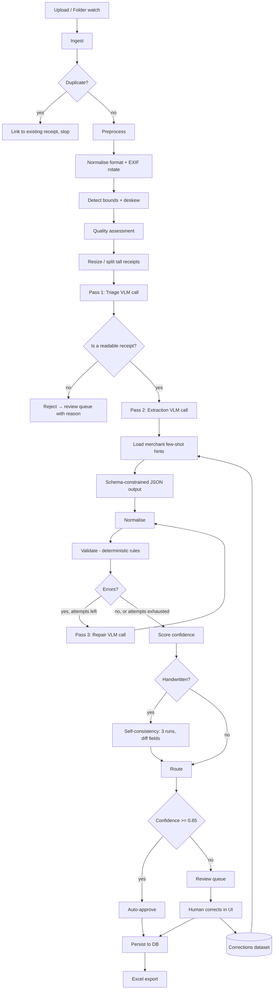

# Receipt Digitization System — Build Specification

**Version:** 1.0
**Status:** Ready to build
**Audience:** Claude Code (primary), human reviewers (secondary)

---

## Contents

| § | Section | Purpose |
|---|---|---|
| 0 | How to use this document | Rules for the implementing agent |
| 1 | Problem statement | Inputs, outputs, success criteria |
| 2 | Non-goals for v1 | What not to build |
| 3 | Architecture | Pipeline diagram + stage responsibilities |
| 4 | Tech stack | Library choices |
| 5 | Repository layout | Directory structure |
| 6 | Data model | Seven tables, full column specs |
| 7 | Canonical extraction schema | The Pydantic contract |
| 8 | **The extraction prompts** | All prompt text, verbatim |
| 9 | Normalisation | Canonicalisation rules |
| 10 | **Validation** | 28 rules, tolerance, repair loop |
| 11 | Self-consistency | Handwriting uncertainty signal |
| 12 | Confidence scoring and routing | Penalty table + thresholds |
| 13 | Excel export | Four sheets, formatting |
| 14 | **Function inventory** | Every function, by module |
| 15 | Build milestones | M0–M7, in order |
| 16 | Evaluation harness | Metrics and calibration |
| 17 | Configuration | Env vars |
| 18 | Operational notes and traps | Known failure modes |
| 19 | Definition of done | v1 checklist |

---

## 0. How to use this document

This is the authoritative spec. Read it fully before writing any code.

**Rules for the implementing agent:**

1. Build in the milestone order defined in §15. Do not skip ahead. Milestone 0 (the golden set) comes before any pipeline code — the whole system is tuned against it.
2. Every function listed in §14 should exist with the given name and signature. If you deviate, note why in a comment.
3. The VLM layer **never** writes to Excel or the database directly. It returns a validated object; the persistence layer writes it.
4. All monetary values are `Decimal`, never `float`. Use `decimal.Decimal` throughout and only convert at the display/export boundary.
5. Prefer boring, deterministic code for validation. No model calls inside `validate()`.
6. Every module gets type hints and a pytest file. Extraction and validation get the most test coverage.
7. When something is ambiguous in this spec, choose the option that fails loudly rather than silently.

**Core design principle:** a wrong number is much worse than a missing number. The system is optimised for *precision on auto-approved receipts*, not for raw extraction coverage.

---

## 1. Problem statement

Convert photographs of retail receipts into structured, queryable data and an Excel workbook.

**Inputs**
- JPEG, PNG, HEIC, WEBP, and single/multi-page PDF
- Receipts from arbitrary merchants — no template per merchant
- Both machine-printed (thermal, dot matrix, laser) and **handwritten** receipts
- Real-world capture conditions: phone photos, glare, folds, faded thermal ink, partial crops

**Outputs**
- Normalised records in a relational database
- An `.xlsx` workbook with a receipt-level sheet and a line-item-level sheet
- A review queue for anything the system is not confident about

**Definition of done for v1**
- ≥ 99% precision on auto-approved receipts (of receipts the system approves without human review, ≥ 99% are fully correct on the critical fields)
- ≥ 70% auto-approval rate on machine-printed receipts
- ≥ 30% auto-approval rate on handwritten receipts
- Every receipt is either auto-approved or in the review queue — nothing is silently dropped

---

## 2. Non-goals for v1

Explicitly out of scope. Do not build these.

- Mobile app (folder watcher + simple upload endpoint is enough)
- Multi-tenant / user accounts / permissions
- Real-time processing guarantees (async queue is fine; minutes of latency is acceptable)
- Model fine-tuning (collect the data for it, don't do it yet)
- Accounting software integrations (QuickBooks, Xero, etc.)
- Line-item categorisation / expense classification
- Currency conversion

---

## 3. Architecture



**Stage responsibilities**

| Stage | Owns | Never does |
|---|---|---|
| Ingest | Dedupe, job creation, blob storage | Any parsing |
| Preprocess | Geometry and quality only | Content interpretation |
| Extract | All model calls | Arithmetic, normalisation |
| Normalise | Type coercion, date/currency canonicalisation | Judging correctness |
| Validate | Deterministic rules only | Model calls, mutation of the record |
| Score | Combine signals into one number | Rule evaluation |
| Route | Threshold decision | Anything else |
| Persist | DB writes | Business logic |
| Export | XLSX generation | DB writes |

---

## 4. Tech stack

| Concern | Choice | Note |
|---|---|---|
| Language | Python 3.11+ | Needed for modern typing |
| API | FastAPI | Upload endpoint + review UI backend |
| Models/validation | Pydantic v2 | Extraction schema is a Pydantic model |
| DB | PostgreSQL (prod), SQLite (dev) | Via SQLAlchemy 2.0 |
| Migrations | Alembic | |
| Queue | RQ + Redis | Celery is fine too; RQ is simpler |
| Images | Pillow + OpenCV | `pillow-heif` for HEIC |
| PDF | `pypdfium2` | Rasterise PDF pages to images |
| Excel | `openpyxl` | Needs formatting + hyperlinks, so not `pandas.to_excel` |
| Blob storage | Local FS (dev), S3/MinIO (prod) | Abstract behind `StorageBackend` |
| Logging | `structlog` | JSON logs, one event per pipeline stage |
| Testing | pytest + pytest-asyncio | |
| Config | `pydantic-settings` | Env vars only, no hardcoded keys |

**Model provider:** abstract behind a `VLMClient` protocol (§14.3). v1 ships one hosted implementation. Do not couple the pipeline to a specific vendor's SDK anywhere outside `extract/clients/`.

---

## 5. Repository layout

```
receipt-digitizer/
├── pyproject.toml
├── alembic/
├── config/
│   ├── settings.py              # pydantic-settings
│   └── rules.yaml               # validation tolerances, thresholds
├── src/receipts/
│   ├── ingest/
│   │   ├── ingest.py
│   │   ├── dedupe.py
│   │   └── storage.py
│   ├── preprocess/
│   │   ├── image_ops.py
│   │   ├── bounds.py
│   │   └── quality.py
│   ├── extract/
│   │   ├── schema.py            # Pydantic extraction models
│   │   ├── prompts.py           # ALL prompt text lives here
│   │   ├── extractor.py         # orchestrates the 3 passes
│   │   ├── consistency.py       # self-consistency for handwriting
│   │   └── clients/
│   │       ├── base.py          # VLMClient protocol
│   │       └── hosted.py
│   ├── normalize/
│   │   ├── numbers.py
│   │   ├── dates.py
│   │   └── text.py
│   ├── validate/
│   │   ├── rules.py             # one function per rule
│   │   ├── validator.py         # runs rules, builds report
│   │   └── report.py            # Finding, ValidationReport
│   ├── score/
│   │   └── confidence.py
│   ├── merchants/
│   │   ├── registry.py
│   │   └── fingerprint.py
│   ├── persist/
│   │   ├── models.py            # SQLAlchemy ORM
│   │   └── repository.py
│   ├── export/
│   │   └── xlsx.py
│   ├── review/
│   │   ├── api.py
│   │   └── queue.py
│   ├── pipeline.py              # the top-level orchestrator
│   └── cli.py
├── eval/
│   ├── golden/                  # Milestone 0 lives here
│   │   ├── images/
│   │   └── labels/*.json
│   ├── harness.py
│   └── metrics.py
└── tests/
```

---

## 6. Data model

Seven tables. `receipts` is the head; everything else hangs off it.

### 6.1 `merchants`
| Column | Type | Notes |
|---|---|---|
| `id` | uuid PK | |
| `canonical_name` | text | Cleaned display name |
| `tax_id` | text nullable | Strongest fingerprint when present |
| `name_variants` | jsonb | All raw printed spellings seen |
| `address` | text nullable | |
| `default_currency` | char(3) nullable | |
| `hints` | jsonb | Free-text extraction hints injected into the prompt |
| `receipt_count` | int | |
| `created_at` / `updated_at` | timestamptz | |

### 6.2 `receipts`
| Column | Type | Notes |
|---|---|---|
| `id` | uuid PK | |
| `merchant_id` | uuid FK nullable | Null until resolved |
| `merchant_name_raw` | text nullable | Exactly as printed |
| `receipt_number` | text nullable | |
| `txn_date` | date nullable | |
| `txn_time` | time nullable | |
| `date_raw` | text nullable | Preserved when ambiguous |
| `currency` | char(3) nullable | ISO 4217 |
| `subtotal` | numeric(14,4) nullable | |
| `tax_total` | numeric(14,4) nullable | |
| `discount_total` | numeric(14,4) nullable | |
| `total` | numeric(14,4) nullable | |
| `tender_amount` | numeric(14,4) nullable | |
| `change_amount` | numeric(14,4) nullable | |
| `payment_method` | text nullable | |
| `card_last4` | char(4) nullable | |
| `is_handwritten` | bool | |
| `legibility` | enum | good / fair / poor / unreadable |
| `confidence` | numeric(4,3) | 0.000–1.000 |
| `confidence_reasons` | jsonb nullable | The `(reason, penalty)` pairs that produced `confidence`, penalties as strings. **Null means "not recorded"; `[]` means "nothing lowered the score"** — the review UI must not collapse the two. Written by `process_receipt`; it cannot be recomputed at read time, because triage issues and `meta.ambiguous_fields` are not persisted (ADR-0012) |
| `status` | enum | pending / auto_approved / needs_review / reviewed / rejected. A row is `pending` from `POST /upload` until the worker persists. **A machine run never overwrites a `reviewed` row** (ADR-0012) |
| `image_key` | text | Blob storage key, original |
| `processed_image_key` | text nullable | Post-deskew |
| `image_phash` | char(16) | Perceptual hash for dedupe |
| `duplicate_of` | uuid FK nullable | Self-reference |
| `receipt_is_inconsistent` | bool | Printed receipt itself doesn't add up |
| `created_at` / `updated_at` | timestamptz | |

Indexes: `(merchant_id, txn_date)`, `(status)`, `(image_phash)`, `(merchant_id, txn_date, total)` for dedupe.

### 6.3 `line_items`
| Column | Type | Notes |
|---|---|---|
| `id` | uuid PK | |
| `receipt_id` | uuid FK | ON DELETE CASCADE |
| `position` | int | Order as printed, 0-based |
| `description_raw` | text | Exactly as printed |
| `sku` | text nullable | |
| `qty` | numeric(12,4) nullable | |
| `unit` | text nullable | e.g. kg, pcs |
| `unit_price` | numeric(14,4) nullable | |
| `line_total` | numeric(14,4) nullable | |
| `modifiers` | jsonb | Item-level discounts/promos |
| `bbox` | jsonb nullable | `[x0,y0,x1,y1]` normalised 0–1 |
| `line_confidence` | numeric(4,3) | |

### 6.4 `extraction_runs`
Immutable audit log. One row per model call.

| Column | Type | Notes |
|---|---|---|
| `id` | uuid PK | |
| `receipt_id` | uuid FK | |
| `pass_name` | enum | triage / extract / repair / consistency |
| `attempt` | int | |
| `model_id` | text | |
| `prompt_hash` | char(16) | Which prompt version was used |
| `raw_response` | jsonb | Verbatim model output |
| `latency_ms` | int | |
| `input_tokens` / `output_tokens` | int | |
| `cost_usd` | numeric(10,6) | |
| `created_at` | timestamptz | |

### 6.5 `validation_findings`
| Column | Type | Notes |
|---|---|---|
| `id` | uuid PK | |
| `receipt_id` | uuid FK | |
| `rule_id` | text | e.g. `R022` |
| `severity` | enum | error / warn / info |
| `message` | text | Human readable |
| `context` | jsonb | Numbers involved, for the repair prompt |
| `resolved_by_repair` | bool | |
| `created_at` | timestamptz | Write order, so findings read back in the order they were produced |

### 6.6 `corrections`
Training data. Every human edit lands here.

| Column | Type | Notes |
|---|---|---|
| `id` | uuid PK | |
| `receipt_id` | uuid FK | |
| `field_path` | text | e.g. `totals.total`, `line_items[3].qty` |
| `value_before` | text nullable | |
| `value_after` | text nullable | |
| `corrected_by` | text | |
| `created_at` | timestamptz | |

### 6.7 `review_tasks`
| Column | Type | Notes |
|---|---|---|
| `id` | uuid PK | |
| `receipt_id` | uuid FK unique | |
| `reason` | text | Why it was routed here |
| `priority` | int | Lower = review sooner |
| `assigned_to` | text nullable | |
| `state` | enum | open / in_progress / done |
| `opened_at` / `closed_at` | timestamptz | |

### 6.8 `users`
Who may sign in to the review service. Exists so `corrections.corrected_by` names a
real account: a shared key cannot attribute a correction to a reviewer, which would
hollow out the audit trail the review UI depends on (ADR-0012).

| Column | Type | Notes |
|---|---|---|
| `id` | uuid PK | |
| `username` | text unique | |
| `password_hash` | text | stdlib scrypt, encoded `scrypt$n$r$p$salt$hash` |
| `role` | varchar(16) | `reviewer` / `admin`. Deliberately **not** a DB enum — the migration drift guard runs on SQLite only and cannot see a new enum member |
| `is_active` | bool | Re-read on every request, so a deactivation takes effect immediately |
| `created_at` / `updated_at` | timestamptz | |

---

## 7. Canonical extraction schema

This is the contract between the model and the rest of the system. `src/receipts/extract/schema.py`.

```python
from decimal import Decimal
from enum import Enum
from typing import Literal
from pydantic import BaseModel, Field


class Legibility(str, Enum):
    GOOD = "good"
    FAIR = "fair"
    POOR = "poor"
    UNREADABLE = "unreadable"


class Modifier(BaseModel):
    """An item-level discount, promo, or adjustment printed under a line item."""
    label: str
    amount: Decimal | None = None


class LineItem(BaseModel):
    position: int
    description_raw: str
    sku: str | None = None
    qty: Decimal | None = None
    unit: str | None = None
    unit_price: Decimal | None = None
    line_total: Decimal | None = None
    modifiers: list[Modifier] = Field(default_factory=list)
    bbox: list[float] | None = Field(
        default=None,
        description="[x0,y0,x1,y1] normalised 0-1, if the model supports grounding",
    )


class Merchant(BaseModel):
    name: str | None = None
    branch: str | None = None
    address: str | None = None
    tax_id: str | None = None
    phone: str | None = None


class ReceiptMeta(BaseModel):
    number: str | None = None
    date: str | None = Field(default=None, description="ISO 8601 YYYY-MM-DD")
    date_raw: str | None = Field(default=None, description="Verbatim if ambiguous")
    time: str | None = Field(default=None, description="HH:MM 24h")
    currency: str | None = Field(default=None, description="ISO 4217, e.g. PHP")
    decimal_convention: Literal["point", "comma"] = "point"
    cashier: str | None = None
    terminal: str | None = None


class Totals(BaseModel):
    subtotal: Decimal | None = None
    tax: Decimal | None = None
    tax_breakdown: list[dict] = Field(
        default_factory=list,
        description="e.g. [{'label':'VATable','base':100.00,'rate':0.12,'amount':12.00}]",
    )
    discount: Decimal | None = None
    total: Decimal | None = None
    tender: Decimal | None = None
    change: Decimal | None = None


class Payment(BaseModel):
    method: str | None = None
    card_last4: str | None = None


class ExtractionMeta(BaseModel):
    is_handwritten: bool = False
    legibility: Legibility = Legibility.GOOD
    ambiguous_fields: list[str] = Field(
        default_factory=list,
        description="Dotted paths the model was unsure about",
    )
    unreadable_regions: list[str] = Field(default_factory=list)
    receipt_is_inconsistent: bool = Field(
        default=False,
        description="Set only when the PRINTED receipt genuinely does not add up",
    )
    notes: str | None = None


class ReceiptExtraction(BaseModel):
    merchant: Merchant = Field(default_factory=Merchant)
    receipt: ReceiptMeta = Field(default_factory=ReceiptMeta)
    line_items: list[LineItem] = Field(default_factory=list)
    totals: Totals = Field(default_factory=Totals)
    payment: Payment = Field(default_factory=Payment)
    meta: ExtractionMeta = Field(default_factory=ExtractionMeta)
```

**Triage schema (pass 1) — separate, deliberately tiny:**

```python
class TriageResult(BaseModel):
    is_receipt: bool
    document_type: Literal[
        "pos_receipt", "handwritten_receipt", "invoice",
        "delivery_note", "not_a_receipt"
    ]
    print_type: Literal["thermal", "dot_matrix", "laser", "handwritten", "mixed"]
    legibility: Legibility
    estimated_line_item_count: int
    merchant_name_guess: str | None
    language: str | None            # ISO 639-1
    issues: list[str]               # blurry, glare, folded, faded, cropped, partial
```

---

## 8. The extraction prompts

All prompt text lives in `src/receipts/extract/prompts.py` as module-level constants. Each has a `PROMPT_VERSION` string; log the hash into `extraction_runs.prompt_hash` so you can attribute accuracy changes to prompt changes.

### 8.1 System prompt (used for pass 2 and pass 3)

```
You are a receipt data extraction engine. You convert photographs of receipts into
structured JSON for an accounting pipeline. In this pipeline, a wrong number is far
worse than a missing number.

RULES, in priority order:

1. TRANSCRIBE — DO NOT INFER.
   Output only what is visibly printed or written on the receipt. If a field is not
   present, is cut off, or you cannot read it, output null.
   - Never compute a value that is not printed. If the subtotal is not shown, do not
     add up the line items to produce one — return null.
   - Never infer a merchant name from a logo you only partly recognise.
   - Never "correct" arithmetic. If the printed numbers do not add up, report them
     exactly as printed and set meta.receipt_is_inconsistent = true.

2. NULL IS A CORRECT ANSWER.
   You are not penalised for nulls. You are heavily penalised for confident wrong
   values. When a character is genuinely ambiguous (a 1 that could be a 7, a 5 that
   could be an S), give your best reading AND add the field's dotted path to
   meta.ambiguous_fields.

3. PRESERVE AS PRINTED.
   - merchant.name: exactly as printed, including punctuation, casing, and legal
     suffixes.
   - line_items[].description_raw: exactly as printed, including abbreviations and
     truncations. "CHKN BRST 1KG" stays "CHKN BRST 1KG" — do not expand it to
     "Chicken Breast 1kg".
   - Do not translate anything. Keep the original language.

4. NUMBERS.
   - All monetary values are JSON numbers, not strings. No currency symbols, no
     thousands separators. "1,234.50" becomes 1234.50.
   - If the receipt uses comma as the decimal separator ("1.234,50"), convert to
     1234.50 and set receipt.decimal_convention = "comma".
   - Refunds, voids, and discounts are NEGATIVE numbers.
   - Never round and never pad. If the receipt prints 3 decimal places, keep 3.
   - If a digit is obscured, do not guess the whole number — null the field.

5. LINE ITEMS.
   - One object per purchasable line, in printed order, position starting at 0.
   - A line that wraps onto two physical rows is ONE line item.
   - Item-level discounts or promos printed beneath an item go into that item's
     modifiers array, NOT as separate line items.
   - Basket-level discounts go in totals.discount, NOT in line_items.
   - Do NOT create line items for: subtotal, tax, total, change, cashier name,
     store slogans, loyalty points, barcodes, or footer text.
   - If quantity is not printed, leave qty null — do not assume 1.

6. DATES AND TIMES.
   - receipt.date must be ISO 8601 YYYY-MM-DD. receipt.time must be HH:MM, 24-hour.
   - If the printed date is ambiguous between conventions (e.g. "03/04/2026" could be
     3 April or 4 March), set receipt.date to null, put the verbatim string in
     receipt.date_raw, and add "receipt.date" to meta.ambiguous_fields.
   - A two-digit year may be expanded only when unambiguous in context.

7. TAX.
   - Populate totals.tax with the total tax charged.
   - If the receipt prints a tax breakdown (taxable base, exempt, zero-rated, rate
     bands), fill totals.tax_breakdown with one object per band. Do not compute
     bands that are not printed.

8. OUTPUT.
   Return exactly one JSON object matching the provided schema. No markdown code
   fences. No prose before or after. No explanation.
```

### 8.2 Pass 1 — triage prompt

Cheap call. Rejects garbage before you spend money on extraction, and selects the pass-2 variant.

```
Classify this image. Do NOT extract any amounts, item names, or totals.

Return exactly one JSON object:

{
  "is_receipt": boolean,
  "document_type": "pos_receipt" | "handwritten_receipt" | "invoice" |
                   "delivery_note" | "not_a_receipt",
  "print_type": "thermal" | "dot_matrix" | "laser" | "handwritten" | "mixed",
  "legibility": "good" | "fair" | "poor" | "unreadable",
  "estimated_line_item_count": integer,
  "merchant_name_guess": string | null,
  "language": string | null,
  "issues": array of any of
            ["blurry","glare","folded","faded","cropped","partial","low_resolution",
             "obstructed","multiple_receipts","not_flat"]
}

Guidance:
- "mixed" print_type means a pre-printed form filled in by hand. This is common and
  should be classified as "handwritten_receipt" for document_type.
- legibility "unreadable" means a human could not reliably read the totals either.
- If more than one receipt appears in the frame, set issues to include
  "multiple_receipts" and is_receipt to true.

JSON only.
```

**Routing on the triage result:**

| Condition | Action |
|---|---|
| `is_receipt == false` | Reject, `status = rejected`, reason `not_a_receipt` |
| `legibility == "unreadable"` | Skip extraction, straight to review with reason `illegible` |
| `"multiple_receipts" in issues` | Route to review with reason `needs_splitting` |
| `document_type == "handwritten_receipt"` | Pass 2 with handwriting variant + self-consistency |
| otherwise | Pass 2 standard |

### 8.3 Pass 2 — extraction prompt

User message = the composed text below + the image.

```
Extract this receipt into the schema.

{MERCHANT_HINTS_BLOCK}

{FEW_SHOT_BLOCK}

Reminders for this receipt:
- Print type: {print_type}
- Expected line items: roughly {estimated_line_item_count}
- Known issues with this image: {issues}

Work top to bottom through the receipt. Before returning, verify:
  (a) every line item you listed is a purchasable item, not a subtotal or footer line
  (b) you have not invented any number that is not printed
  (c) every field you were unsure about is listed in meta.ambiguous_fields

Return JSON only.
```

**`{MERCHANT_HINTS_BLOCK}`** — injected only when the merchant is recognised from triage or a prior fingerprint. Pulled from `merchants.hints`:

```
This receipt appears to be from {canonical_name}. Known characteristics:
- {hint 1}
- {hint 2}
Use these as guidance only. If what you see contradicts them, trust the image.
```

That last sentence is load-bearing. Without it, hints become a source of hallucination on the day a merchant changes their receipt format.

**`{FEW_SHOT_BLOCK}`** — up to 2 verified prior extractions for the same merchant, as `image + expected JSON` pairs. Only use extractions with `status = reviewed` and zero corrections. This is the single highest-leverage accuracy improvement once you have volume.

### 8.4 Handwriting variant

Appended to the pass 2 prompt when `document_type == "handwritten_receipt"`:

```
This receipt is handwritten. Additional rules:

- Handwritten digits are the primary risk. 1/7, 0/6, 3/8, 5/S, and 4/9 are commonly
  confused. When a digit is ambiguous, null the ENTIRE number rather than guessing a
  digit, and record the field path in meta.ambiguous_fields.
- Do not normalise handwritten item names into retail product names. Transcribe the
  characters you actually see.
- Handwritten receipts frequently omit subtotal, tax, or quantity entirely. Leave
  those null. Do not derive them.
- Currency symbols are often omitted. Leave receipt.currency null unless a symbol or
  code is actually written.
- If the writer crossed something out and rewrote it, transcribe the final value and
  note the correction in meta.notes.
```

### 8.5 Pass 3 — repair prompt

Fired only when `validate()` returns ERROR-severity findings. Maximum 1 repair attempt by default (`MAX_REPAIR_ATTEMPTS`, configurable).

```
You previously extracted this receipt as:

{previous_json}

Automated validation found these problems:

{findings_block}

Re-examine the image and return a corrected JSON object in the same schema.

Rules for this correction pass:
- Change only the fields that are actually wrong when you re-read the image. Leave
  everything else byte-identical.
- Do NOT alter numbers to make the arithmetic work. If the receipt as printed
  genuinely does not add up, keep the printed values and set
  meta.receipt_is_inconsistent = true.
- If re-reading shows a value is not legible after all, set it to null rather than
  keeping your earlier guess.
- If a validation complaint is wrong — the original extraction was right — keep the
  original value and explain briefly in meta.notes.

Return JSON only.
```

`{findings_block}` is rendered from `validation_findings`, one line each:

```
[R022] Totals equation failed: subtotal(847.50) + tax(101.70) - discount(0.00)
       = 949.20, but total was extracted as 847.50.
[R021] Line item 3 "CHKN BRST 1KG": qty(2) x unit_price(185.00) = 370.00,
       but line_total was extracted as 185.00.
```

Giving the model the *specific numbers* is what makes this pass work. A generic "please check your math" does very little.

### 8.6 Prompt engineering notes

- Keep all prompts in one module. Never build prompt strings inline in business logic.
- Bump `PROMPT_VERSION` on any change and re-run the eval harness (§16). An unmeasured prompt change is a regression waiting to happen.
- Do not add examples to the system prompt. Few-shot examples belong in the user turn where they can be merchant-specific.
- Resist growing the system prompt past ~1200 tokens. Past that, later rules get progressively ignored. If you need more rules, put them in the merchant hints block instead.

---

## 9. Normalisation

Runs between extraction and validation. Pure functions, no model calls, no I/O.

```python
def normalize(raw: ReceiptExtraction) -> ReceiptExtraction:
    """Return a canonicalised copy. Never mutates the input.

    Order matters:
      1. text  — strip control chars, collapse whitespace, fix common OCR confusions
                 in NON-numeric fields only
      2. numbers — coerce to Decimal, apply decimal_convention, strip symbols
      3. dates   — parse to ISO, resolve 2-digit years, split date/time
      4. currency — resolve symbol -> ISO 4217 using merchant default as tiebreak
      5. derive  — fill line_items[].position if missing; sort by position
    """
```

**Hard rules for this layer:**

- Normalisation may **reformat** a value. It may never **invent** one. If `subtotal` is null coming in, it is null coming out.
- Never apply character-confusion fixes to numeric fields. Turning a handwritten `O` into `0` inside a price is exactly the silent corruption this system exists to prevent. Null it instead and let validation flag it.
- Currency symbol resolution is ambiguous by nature (`$` maps to a dozen currencies). Resolve using, in order: explicit ISO code on the receipt → merchant's `default_currency` → system default → null. Never guess from language.

---

## 10. Validation

The most important module in the system, and entirely deterministic. `src/receipts/validate/`.

### 10.1 Types

```python
class Severity(str, Enum):
    ERROR = "error"   # blocks auto-approval, triggers a repair pass
    WARN  = "warn"    # reduces confidence, does not block
    INFO  = "info"    # recorded only


class Finding(BaseModel):
    rule_id: str
    severity: Severity
    message: str                 # rendered into the repair prompt
    field_paths: list[str] = []
    context: dict = {}           # the actual numbers, for the repair prompt


class ValidationReport(BaseModel):
    findings: list[Finding]

    @property
    def has_errors(self) -> bool:
        return any(f.severity == Severity.ERROR for f in self.findings)

    @property
    def error_count(self) -> int: ...

    @property
    def warn_count(self) -> int: ...

    def by_rule(self, rule_id: str) -> list[Finding]: ...
    def render_for_repair_prompt(self) -> str: ...
```

### 10.2 Tolerance

Rounding differences are real; floating comparisons are not acceptable.

```python
def within_tolerance(a: Decimal, b: Decimal, *, rel: Decimal = Decimal("0.0002"),
                     floor: Decimal = Decimal("0.02")) -> bool:
    """True when a and b agree to within max(floor, rel * max(|a|,|b|)).

    floor=0.02 absorbs cent-level rounding and does the real work.
    rel=0.0002 is a small safety valve for very large totals and 3-decimal
    currencies.
    """
    if a is None or b is None:
        return False
    tol = max(floor, rel * max(abs(a), abs(b)))
    return abs(a - b) <= tol
```

**Keep `rel` small.** Rounding error is bounded in cents; it is not proportional to magnitude. A 0.5% relative tolerance grants ±4.75 on a 949.20 total, which means a misread `945.20` passes validation silently — defeating the entire purpose of the rule. At 0.0002 the tolerance is ±0.19: rounding is absorbed, misreads are caught.

Where error genuinely does accumulate — summing many line items — handle it **explicitly** by scaling the floor with line count (`floor = max(base, 0.01 × n_lines)` in R020/R024), not by inflating the relative term.

Tolerances live in `config/rules.yaml` so they can be tuned per deployment without a code change.

### 10.3 Rule catalogue

Each rule is a function `(ReceiptExtraction, ValidationContext) -> list[Finding]` registered in a `RULES` list. Rules never mutate the record.

| ID | Rule | Severity | Description |
|---|---|---|---|
| **Presence** | | | |
| `R001` | `schema_parses` | ERROR | Model output deserialised into `ReceiptExtraction` |
| `R010` | `total_present` | ERROR | `totals.total` is not null |
| `R011` | `date_present` | WARN | `receipt.date` is not null |
| `R012` | `merchant_present` | WARN | `merchant.name` is not null |
| `R013` | `line_items_present` | WARN | At least one line item, unless triage said 0 expected |
| **Arithmetic** | | | |
| `R020` | `line_items_sum_to_subtotal` | ERROR | `Σ line_total ≈ subtotal`, or `≈ total` when the amount column is tax-inclusive (skipped if subtotal null) |
| `R021` | `line_item_math` | ERROR | Per row: `qty × unit_price ≈ line_total` (skipped if any null) |
| `R022` | `totals_equation` | ERROR | `subtotal + tax − discount ≈ total` |
| `R023` | `tender_change` | WARN | `tender − total ≈ change` |
| `R024` | `line_items_sum_to_total` | WARN | Fallback when subtotal is null: `Σ line_total ≈ total − tax + discount`, or `≈ total` when the amount column is tax-inclusive |
| `R025` | `tax_breakdown_sums` | WARN | `Σ tax_breakdown[].amount ≈ tax` |
| **Plausibility** | | | |
| `R030` | `date_parseable` | ERROR | `receipt.date` is a real calendar date |
| `R031` | `date_not_future` | ERROR | Not more than 1 day ahead of now (timezone slack) |
| `R032` | `date_not_ancient` | WARN | Not older than `MAX_RECEIPT_AGE_YEARS` (default 10) |
| `R033` | `currency_known` | WARN | Valid ISO 4217 code |
| `R040` | `total_positive` | ERROR | `total > 0` unless flagged as a refund |
| `R041` | `total_magnitude` | WARN | `0.01 ≤ total ≤ MAX_PLAUSIBLE_TOTAL` |
| `R042` | `unit_prices_sane` | WARN | No `unit_price` more than 100× the median on the receipt |
| `R043` | `qty_sane` | WARN | `0 < qty ≤ 10_000` |
| `R044` | `tax_rate_plausible` | WARN | `tax / subtotal` within `[0, 0.35]` |
| `R045` | `discount_not_exceeding` | WARN | `discount ≤ subtotal` |
| **Integrity** | | | |
| `R050` | `no_duplicate_line_items` | INFO | Identical description+qty+price adjacent rows |
| `R051` | `positions_contiguous` | INFO | Positions are 0..n−1 with no gaps |
| `R052` | `no_total_row_as_line_item` | ERROR | No line item whose description matches `SUBTOTAL / TOTAL / TAX / VAT / CHANGE / CASH` |
| `R053` | `description_not_empty` | WARN | No blank `description_raw` |
| **Grounding** | | | |
| `R060` | `total_appears_in_ocr` | WARN | Formatted total string found in the raw OCR text layer, if OCR is available |
| `R061` | `merchant_appears_in_ocr` | INFO | Same, for merchant name |
| **Self-consistency** | | | |
| `R070` | `consistency_agreement` | WARN | Field disagreed across self-consistency runs (§11) |

**R052 deserves emphasis.** The most common structural failure is a model emitting `SUBTOTAL 847.50` as a line item, which then breaks `R020` in a confusing way. Catch it explicitly so the repair prompt gets a clear message instead of an arithmetic complaint.

**R020/R024 and the tax convention.** Whether the line-item amount column is net of tax or tax-inclusive is a property of the *document*, not of the extraction. On a Philippine BIR "SALES INVOICE" the amounts include VAT, so `Σ line_total == total` while `subtotal` is the net-of-VAT tax base — and `R022` still reconciles. `totals.prices_include_tax` records the convention: `False` compares the line sum against `subtotal`, `True` against `total`, and `null` (the usual case, since the document rarely states it) accepts **either** and fires only when neither fits, naming both comparisons in the finding. Assuming a convention here is what turns a correct extraction into a false ERROR that blocks auto-approval, burns a repair call, and pressures the model into changing numbers that are already right.

### 10.4 The validator

```python
def validate(receipt: ReceiptExtraction,
             ctx: ValidationContext) -> ValidationReport:
    """Run every registered rule and collect findings.

    ctx carries: triage result, OCR text layer (optional), merchant record
    (optional), consistency diff (optional), and the loaded tolerance config.

    Guarantees:
      - never mutates `receipt`
      - never makes a network call
      - never raises: a rule that throws is caught and recorded as an
        INFO finding with rule_id "<id>.crashed"
      - deterministic: same inputs always produce the same report
    """
    findings: list[Finding] = []
    for rule in RULES:
        if not rule.applies(receipt, ctx):
            continue
        try:
            findings.extend(rule.check(receipt, ctx))
        except Exception as exc:
            findings.append(Finding(
                rule_id=f"{rule.id}.crashed",
                severity=Severity.INFO,
                message=f"Rule crashed: {exc!r}",
            ))
    return ValidationReport(findings=findings)
```

Note `rule.applies(...)`. Most arithmetic rules are meaningless when their inputs are null, and firing them anyway produces noisy findings that pollute the repair prompt. A rule that cannot run should **skip**, not fail.

### 10.5 Worked example of a rule

```python
@register
class TotalsEquation(Rule):
    id = "R022"
    severity = Severity.ERROR

    def applies(self, r: ReceiptExtraction, ctx: ValidationContext) -> bool:
        return r.totals.total is not None and r.totals.subtotal is not None

    def check(self, r: ReceiptExtraction, ctx: ValidationContext) -> list[Finding]:
        t = r.totals
        tax = t.tax or Decimal(0)
        disc = t.discount or Decimal(0)
        expected = t.subtotal + tax - disc

        if within_tolerance(expected, t.total, **ctx.tol("R022")):
            return []

        return [Finding(
            rule_id=self.id,
            severity=self.severity,
            message=(
                f"Totals equation failed: subtotal({t.subtotal}) + tax({tax}) "
                f"- discount({disc}) = {expected}, but total was extracted "
                f"as {t.total} (difference {abs(expected - t.total)})."
            ),
            field_paths=["totals.subtotal", "totals.tax",
                         "totals.discount", "totals.total"],
            context={
                "subtotal": str(t.subtotal), "tax": str(tax),
                "discount": str(disc), "expected": str(expected),
                "actual": str(t.total),
            },
        )]
```

The message string is written to be read by the repair model, not by a developer. Every arithmetic rule should name the specific numbers.

### 10.6 The repair loop

```python
def extract_with_repair(image: PreparedImage,
                        triage: TriageResult,
                        ctx: ValidationContext,
                        max_attempts: int = 1
                        ) -> tuple[ReceiptExtraction, ValidationReport]:
    """Extract, validate, and repair up to max_attempts times.

    Returns the BEST attempt, defined as fewest errors, then fewest warnings,
    then fewest nulls. A repair pass is not automatically better than the
    original — always compare and keep the winner.

    Every attempt is written to extraction_runs regardless of whether it wins.
    """
```

Keeping the best attempt rather than the last is important. Repair passes sometimes make things worse, particularly on poor-legibility images where the model starts second-guessing correct readings.

---

## 11. Self-consistency (handwriting)

Applied when `triage.document_type == "handwritten_receipt"` or `legibility in {poor, fair}`.

```python
def run_consistency(image: PreparedImage,
                    triage: TriageResult,
                    n: int = 3,
                    temperature: float = 0.3
                    ) -> ConsistencyResult:
    """Extract n times independently and diff the results field by field.

    Returns:
      consensus: ReceiptExtraction  — per-field majority vote
      agreement: dict[str, float]   — fraction agreeing, per dotted field path
      disputed:  list[str]          — paths where agreement < 1.0

    Majority-vote rule: a field takes the value held by a strict majority.
    With no majority, the field is set to NULL and added to disputed.
    Line item arrays are compared by position; a differing item count means
    every line item path is disputed.
    """
```

This costs 3× on the subset of receipts that need it most, and buys a real per-field uncertainty signal that the model will not give you by asking. Disagreement is the honest confidence estimate; a model's self-reported confidence is not.

Set `CONSISTENCY_RUNS = 1` in config to disable during cost-constrained development.

---

## 12. Confidence scoring and routing

```python
def score_confidence(receipt: ReceiptExtraction,
                     report: ValidationReport,
                     triage: TriageResult,
                     consistency: ConsistencyResult | None) -> Decimal:
    """Combine every available signal into one number in [0, 1]."""
```

**Scoring table** — start at 1.0 and subtract. All values live in `config/rules.yaml`.

| Signal | Penalty |
|---|---|
| Any ERROR finding unresolved after repair | −0.35 |
| Each WARN finding | −0.08, capped at −0.30 total |
| `legibility == fair` | −0.10 |
| `legibility == poor` | −0.25 |
| `is_handwritten` | −0.15 |
| `total` is null | −0.30 |
| `date` is null | −0.10 |
| `merchant.name` is null | −0.10 |
| Each field in `meta.ambiguous_fields` | −0.05, capped at −0.20 |
| Each disputed consistency field | −0.06, capped at −0.30 |
| Triage `issues` non-empty | −0.03 per issue, capped at −0.10 |
| Merchant recognised with ≥ 10 prior verified receipts | **+0.05** (bonus) |

Clamp to `[0, 1]`. Round to 3 decimals.

**Routing thresholds:**

| Confidence | Status | Review priority |
|---|---|---|
| `≥ 0.85` | `auto_approved` | — |
| `0.60 – 0.85` | `needs_review` | 2 (quick verify) |
| `< 0.60` | `needs_review` | 1 (full re-key) |
| ERROR findings + `total` null | `needs_review` | 0 (urgent) |

**Do not treat 0.85 as sacred.** It is a starting point. Tune it against the golden set (§16) to hold auto-approval precision at ≥ 99%, then push the threshold as low as that constraint allows to maximise throughput. This calibration is the single most valuable hour of work in the project, and it should be re-run every time the model or prompt changes.

---

## 13. Excel export

`src/receipts/export/xlsx.py`. Excel is an **output format**, never the source of truth. All exports read from the database.

### 13.1 Sheet: `Receipts`

One row per receipt.

| Col | Header | Source |
|---|---|---|
| A | Receipt ID | `receipts.id` (short form) |
| B | Merchant | `merchants.canonical_name` or `merchant_name_raw` |
| C | Branch | |
| D | Tax ID | |
| E | Receipt No. | |
| F | Date | `txn_date`, formatted `yyyy-mm-dd` |
| G | Time | |
| H | Currency | |
| I | Subtotal | numeric, 2dp |
| J | Tax | |
| K | Discount | |
| L | **Total** | bold |
| M | Payment Method | |
| N | Card Last4 | text format, preserves leading zeros |
| O | Items | count of line items |
| P | Handwritten | Yes/No |
| Q | Confidence | percentage format |
| R | Status | |
| S | Flags | comma-joined rule IDs with severity ≥ WARN |
| T | Image | hyperlink to the original |

### 13.2 Sheet: `LineItems`

One row per item. `Receipt ID` is the join key back to sheet 1.

| Col | Header |
|---|---|
| A | Receipt ID |
| B | Merchant |
| C | Date |
| D | Line # |
| E | Description |
| F | SKU |
| G | Qty |
| H | Unit |
| I | Unit Price |
| J | Line Total |
| K | Modifiers (joined) |

Denormalising merchant and date onto the line-item sheet is deliberate — it makes the sheet pivot-table-ready without a VLOOKUP.

### 13.3 Sheet: `Needs Review`

Filtered view of receipts with `status = needs_review`, sorted by priority then date, with a `Reason` column and the image hyperlink. This is the sheet a human actually opens.

### 13.4 Sheet: `Summary`

Small dashboard: receipt count, total value by merchant, date range, auto-approval rate, average confidence, count by status.

### 13.5 Formatting requirements

- Freeze the header row on every sheet; enable autofilter
- Currency columns: `#,##0.00`, right-aligned
- Conditional formatting on `Confidence`: 3-colour scale, red below 0.60
- Rows with unresolved ERROR findings get a light red fill
- Card last-4 and Receipt No. as **text** format — Excel will otherwise mangle them
- Column widths sized to content, capped at 50 characters
- Sheet-level protection off (users need to edit for reconciliation)

```python
def export_workbook(receipts: list[ReceiptRecord],
                    out_path: Path,
                    *,
                    include_review_sheet: bool = True,
                    include_summary: bool = True) -> Path:
    """Write the full workbook. Streams with openpyxl's write_only mode when
    len(receipts) > 5000 to keep memory flat."""
```

---

## 14. Function inventory

Every function the system needs, by module. This is the review checklist — if a function here has no home in the code, something is missing; if code exists that isn't here, question whether it belongs.

### 14.1 `ingest/`

```python
# ingest.py
def ingest_file(path: Path, source: str = "upload") -> ReceiptJob
    """Accept a file, store the original, create a job. Entry point."""

def ingest_bytes(data: bytes, filename: str, source: str) -> ReceiptJob

def expand_pdf(path: Path) -> list[Path]
    """Rasterise each PDF page to a PNG. One receipt per page assumed."""

def validate_upload(path: Path) -> UploadCheck
    """Size limit, MIME sniff, magic-byte check. Reject before storage."""

# dedupe.py
def compute_phash(img: Image) -> str
    """64-bit perceptual hash, hex encoded."""

def phash_distance(a: str, b: str) -> int
    """Hamming distance."""

def find_near_duplicate_image(phash: str, threshold: int = 5) -> Receipt | None

def find_semantic_duplicate(merchant_id: UUID | None, txn_date: date | None,
                            total: Decimal | None) -> Receipt | None
    """Same merchant + date + total = almost certainly a re-upload."""

def link_duplicate(new_id: UUID, existing_id: UUID) -> None

# storage.py
class StorageBackend(Protocol):
    def put(self, key: str, data: bytes, content_type: str) -> str: ...
    def get(self, key: str) -> bytes: ...
    def url(self, key: str, expires_in: int = 3600) -> str: ...
    def delete(self, key: str) -> None: ...

class LocalStorage(StorageBackend): ...
class S3Storage(StorageBackend): ...

def make_image_key(receipt_id: UUID, variant: str) -> str
    """e.g. receipts/{yyyy}/{mm}/{id}/{variant}.jpg"""
```

### 14.2 `preprocess/`

```python
# image_ops.py
def load_image(path: Path) -> Image
    """Handles JPEG/PNG/WEBP/HEIC. Raises UnsupportedFormat otherwise."""

def fix_orientation(img: Image) -> Image
    """Apply EXIF orientation tag, then strip EXIF."""

def to_rgb(img: Image) -> Image
    """Flatten alpha, convert CMYK/grayscale/palette to RGB."""

def resize_for_model(img: Image, max_edge: int = 2048,
                     min_text_height_px: int = 12) -> Image
    """Downscale to the model's window while keeping text legible.
    Warn if the estimated text height would fall below min_text_height_px."""

def split_tall_receipt(img: Image, max_aspect: float = 3.0,
                       overlap_px: int = 120) -> list[Image]
    """Split receipts taller than max_aspect into overlapping vertical strips.
    Overlap must be large enough to fully contain one line item."""

def to_base64(img: Image, fmt: str = "JPEG", quality: int = 90) -> str

# bounds.py
def detect_document_bounds(img: Image) -> Quad | None
    """Largest 4-sided contour after edge detection. None if not confident."""

def deskew_perspective(img: Image, quad: Quad) -> Image
    """Four-point perspective warp to a flat rectangle."""

def auto_crop(img: Image) -> tuple[Image, bool]
    """detect + deskew if bounds found. Returns (image, was_cropped)."""

def estimate_rotation(img: Image) -> float
    """Small-angle skew in degrees, via Hough transform on text baselines."""

# quality.py
def assess_quality(img: Image) -> QualityReport
    """blur_score (Laplacian variance), brightness, contrast, glare_ratio,
    resolution_ok, estimated_text_height. Cheap, runs before any model call."""

def is_processable(report: QualityReport) -> tuple[bool, str | None]
    """Gate: reject obviously unusable images before spending on the API."""
```

### 14.3 `extract/`

```python
# clients/base.py
class VLMClient(Protocol):
    def complete_json(self, *, system: str, user: str,
                      images: list[str], schema: type[BaseModel],
                      temperature: float = 0.0,
                      max_tokens: int = 4096) -> VLMResponse: ...

class VLMResponse(BaseModel):
    parsed: BaseModel | None
    raw_text: str
    model_id: str
    input_tokens: int
    output_tokens: int
    latency_ms: int
    cost_usd: Decimal

# extractor.py
def triage(image: PreparedImage, client: VLMClient) -> TriageResult
    """Pass 1. Cheap classification. Never returns amounts."""

def extract(image: PreparedImage, triage: TriageResult,
            hints: MerchantHints | None, few_shots: list[FewShot],
            client: VLMClient, temperature: float = 0.0) -> ReceiptExtraction
    """Pass 2. The main extraction call."""

def repair(image: PreparedImage, previous: ReceiptExtraction,
           report: ValidationReport, client: VLMClient) -> ReceiptExtraction
    """Pass 3. Targeted correction using the specific findings."""

def extract_with_repair(image: PreparedImage, triage: TriageResult,
                        ctx: ValidationContext, client: VLMClient,
                        max_attempts: int = 1
                        ) -> tuple[ReceiptExtraction, ValidationReport]
    """Full extract -> validate -> repair loop. Returns the BEST attempt."""

def score_attempt(extraction: ReceiptExtraction,
                  report: ValidationReport) -> tuple[int, int, int]
    """Sort key for picking the best attempt:
    (error_count, warn_count, null_field_count). Lower wins."""

# prompts.py
PROMPT_VERSION: str
SYSTEM_EXTRACTION: str
TRIAGE_PROMPT: str
EXTRACTION_PROMPT_TEMPLATE: str
HANDWRITING_ADDENDUM: str
REPAIR_PROMPT_TEMPLATE: str

def build_extraction_prompt(triage: TriageResult, hints: MerchantHints | None,
                            few_shots: list[FewShot]) -> str

def build_repair_prompt(previous: ReceiptExtraction,
                        report: ValidationReport) -> str

def prompt_hash(text: str) -> str
    """16-char hash, logged to extraction_runs."""

# consistency.py
def run_consistency(image: PreparedImage, triage: TriageResult,
                    client: VLMClient, n: int = 3,
                    temperature: float = 0.3) -> ConsistencyResult

def diff_extractions(runs: list[ReceiptExtraction]) -> dict[str, float]
    """Per dotted-path agreement fraction across runs."""

def majority_vote(runs: list[ReceiptExtraction]) -> ReceiptExtraction
    """Per-field majority. No majority -> null."""

def flatten_paths(obj: BaseModel, prefix: str = "") -> dict[str, Any]
    """Model -> {dotted_path: value}. Used by diff and by corrections logging."""
```

### 14.4 `normalize/`

```python
# numbers.py
def parse_money(value: Any, convention: str = "point") -> Decimal | None
    """Strip symbols/separators, honour comma-decimal convention.
    Returns None on anything ambiguous. NEVER guesses."""

def detect_decimal_convention(samples: list[str]) -> str
    """'point' or 'comma', from the shape of numbers on the receipt."""

def quantize_money(d: Decimal, places: int = 2) -> Decimal
    """ROUND_HALF_UP. Used for display only, never before validation."""

# dates.py
def parse_date(raw: str, hint_format: str | None = None
               ) -> tuple[date | None, bool]
    """Returns (parsed_date, was_ambiguous). Ambiguous DD/MM vs MM/DD
    returns (None, True) — the caller must not resolve it by guessing."""

def parse_time(raw: str) -> time | None

def expand_two_digit_year(yy: int, reference: date) -> int

# text.py
def clean_text(s: str) -> str
    """Strip control chars, collapse whitespace, normalise unicode (NFKC).
    Applied to NON-numeric fields only."""

def normalize_merchant_name(s: str) -> str
    """Casefold, strip legal suffixes and branch codes, for fingerprinting.
    The display name keeps the original."""

def normalize_currency(symbol_or_code: str | None,
                       merchant_default: str | None) -> str | None
    """Resolve to ISO 4217. Returns None rather than guessing."""

# __init__.py
def normalize(raw: ReceiptExtraction) -> ReceiptExtraction
    """Top-level. Pure, returns a copy."""
```

### 14.5 `validate/`

```python
# report.py
class Severity(str, Enum): ...
class Finding(BaseModel): ...
class ValidationReport(BaseModel): ...

# rules.py
class Rule(Protocol):
    id: str
    severity: Severity
    def applies(self, r: ReceiptExtraction, ctx: ValidationContext) -> bool: ...
    def check(self, r: ReceiptExtraction, ctx: ValidationContext) -> list[Finding]: ...

RULES: list[Rule]

def register(cls): ...
    """Decorator that appends to RULES."""

def within_tolerance(a: Decimal | None, b: Decimal | None, *,
                     rel: Decimal, floor: Decimal) -> bool

# One class per rule in the §10.3 catalogue:
#   SchemaParses(R001), TotalPresent(R010), DatePresent(R011),
#   MerchantPresent(R012), LineItemsPresent(R013),
#   LineItemsSumToSubtotal(R020), LineItemMath(R021), TotalsEquation(R022),
#   TenderChange(R023), LineItemsSumToTotal(R024), TaxBreakdownSums(R025),
#   DateParseable(R030), DateNotFuture(R031), DateNotAncient(R032),
#   CurrencyKnown(R033), TotalPositive(R040), TotalMagnitude(R041),
#   UnitPricesSane(R042), QtySane(R043), TaxRatePlausible(R044),
#   DiscountNotExceeding(R045), NoDuplicateLineItems(R050),
#   PositionsContiguous(R051), NoTotalRowAsLineItem(R052),
#   DescriptionNotEmpty(R053), TotalAppearsInOcr(R060),
#   MerchantAppearsInOcr(R061), ConsistencyAgreement(R070)

# validator.py
class ValidationContext(BaseModel):
    triage: TriageResult | None
    ocr_text: str | None
    merchant: MerchantRecord | None
    consistency: ConsistencyResult | None
    tolerances: dict

    def tol(self, rule_id: str) -> dict
        """Per-rule tolerance overrides from config/rules.yaml."""

def validate(receipt: ReceiptExtraction,
             ctx: ValidationContext) -> ValidationReport
```

### 14.6 `score/`

```python
# confidence.py
def score_confidence(receipt: ReceiptExtraction, report: ValidationReport,
                     triage: TriageResult,
                     consistency: ConsistencyResult | None) -> Decimal

def explain_confidence(...) -> list[tuple[str, Decimal]]
    """(reason, penalty) pairs. Shown in the review UI so a reviewer can
    see WHY something was flagged."""

def route(confidence: Decimal, report: ValidationReport
          ) -> tuple[ReceiptStatus, int, str]
    """Returns (status, review_priority, reason)."""
```

### 14.7 `merchants/`

```python
# fingerprint.py
def fingerprint(extraction: ReceiptExtraction) -> MerchantFingerprint
    """Built from tax_id (strongest), normalised name, phone, address."""

def match_merchant(fp: MerchantFingerprint,
                   threshold: float = 0.85) -> MerchantRecord | None
    """Exact tax_id match first, then fuzzy name match above threshold."""

def name_similarity(a: str, b: str) -> float
    """Token-set ratio on normalised names."""

# registry.py
def get_or_create_merchant(extraction: ReceiptExtraction) -> MerchantRecord

def add_name_variant(merchant_id: UUID, raw_name: str) -> None

def get_hints(merchant_id: UUID) -> MerchantHints | None

def set_hints(merchant_id: UUID, hints: list[str]) -> None

def get_few_shots(merchant_id: UUID, limit: int = 2) -> list[FewShot]
    """Verified extractions only: status='reviewed' AND zero corrections."""

def suggest_hints(merchant_id: UUID) -> list[str]
    """Analyse the corrections log for this merchant and propose hint text.
    Human-approved before it goes into the prompt — never auto-applied."""
```

### 14.8 `persist/`

```python
# repository.py
def save_extraction(job: ReceiptJob, extraction: ReceiptExtraction,
                    report: ValidationReport, confidence: Decimal,
                    status: ReceiptStatus) -> ReceiptRecord

def save_extraction_run(receipt_id: UUID, pass_name: str, attempt: int,
                        response: VLMResponse, prompt_hash: str) -> None

def save_findings(receipt_id: UUID, report: ValidationReport) -> None

def get_receipt(receipt_id: UUID) -> ReceiptRecord | None

def query_receipts(*, status: ReceiptStatus | None = None,
                   merchant_id: UUID | None = None,
                   date_from: date | None = None,
                   date_to: date | None = None,
                   min_confidence: Decimal | None = None,
                   limit: int = 1000, offset: int = 0) -> list[ReceiptRecord]

def apply_corrections(receipt_id: UUID, patch: dict,
                      corrected_by: str) -> ReceiptRecord
    """Apply a reviewer's edits, write one `corrections` row per changed
    field path, set status='reviewed'. Transactional."""
```

### 14.9 `review/`

```python
# queue.py
def enqueue_review(receipt_id: UUID, reason: str, priority: int) -> ReviewTask
def next_task(assignee: str) -> ReviewTask | None
def close_task(task_id: UUID) -> None
def release_task(task_id: UUID) -> tuple[ReviewTask, str | None]
def queue_stats() -> QueueStats

# api.py  (FastAPI routes)
POST   /auth/login                -> sets the session cookie
POST   /auth/logout
POST   /upload                    -> ReceiptJob (writes a `pending` row first)
GET    /receipts                  -> paginated list
GET    /receipts/{id}             -> record + findings + confidence explanation
PATCH  /receipts/{id}             -> apply corrections
GET    /receipts/{id}/image       -> signed URL
GET    /receipts/{id}/image/blob  -> streams the bytes; HMAC-signed, no session
GET    /review/next               -> next task for the caller
POST   /review/{id}/complete      -> {id} is the TASK id; assignee or admin only
POST   /review/{id}/release       -> {id} is the TASK id; admin only
GET    /export/xlsx               -> returns the workbook
GET    /health
GET    /metrics                   -> counts by status, auto-approval rate
```

Auth is a signed session cookie carrying the username only, with the role re-read
per request, plus a separate `X-API-Key` for unattended upload (ADR-0012). Every
route except `/health`, `/auth/login` and the signed image blob requires a session;
`GET /export/xlsx` and `POST /review/{id}/release` are the routes that require
`admin`. The API key authorizes `POST /upload` and nothing else — it can neither
read a receipt nor write a correction, because a correction must name the person
who made it.

### 14.10 `pipeline.py` and `cli.py`

```python
# pipeline.py
def process_receipt(job: ReceiptJob) -> ReceiptRecord
    """The whole thing, end to end. This is the only function the queue
    worker calls. Each stage is logged; a failure at any stage marks the
    receipt needs_review with the stage name as the reason rather than
    losing the job."""

def process_batch(paths: list[Path], workers: int = 4) -> BatchResult

# cli.py  (as implemented; ADR-0013 is the contract)
receipts ingest <path> [--source S] [--recursive]
receipts process [--limit N] [--inline] [--workers N]
receipts export --out book.xlsx [--from DATE] [--to DATE] [--status S]
                [--merchant-id ID] [--min-confidence D]
receipts eval [--golden-dir DIR] [--results-dir DIR]
receipts calibrate [--results FILE] [--results-dir DIR] [--target D]
receipts merchants list | hints <id> [--add TEXT] [--clear]
receipts reprocess <id> [--force]
receipts users add <name> [--role R] | list | deactivate <name> | set-role <name> <role>
```

**Invocation.** The console script requires the interpreter's `Scripts`/`bin`
directory on `PATH`; `python -m receipts.cli <command>` is the equivalent that
always works and is what the tests use.

**Behaviour worth knowing before reading the code** (all of it ADR-0013):

- `ingest` writes a `pending` row and does **not** enqueue. `process` drains the
  `pending` rows, so an upload over `POST /upload` and a file passed to `ingest`
  share one work list.
- `process` enqueues to RQ by default; `--inline` runs the work in this process.
  A missing `REDIS_URL` while enqueueing is a hard failure naming `--inline`,
  never a silent fallback.
- `reprocess` never overwrites a `reviewed` receipt. `--force` is a status gate,
  not a permission override: it extends the command to `auto_approved` receipts
  and to nothing else.
- `calibrate` refuses a result set with zero receipts, and ignores any threshold
  that auto-approves nothing — `calibration_curve` reports precision `1.0` for an
  empty approved set, so the highest threshold always looks perfect.
- Exit codes: `0` the command completed, `1` it could not, `2` usage. **A receipt
  routed to review does not change the exit code.**
- No interactive prompts anywhere; `users add` reads the password from stdin so it
  works unattended.

---

## 15. Build milestones

Build in this order. Each milestone is independently useful and shippable.

### M0 — Golden set (do this first, before any pipeline code)

Collect 50–100 real receipts covering your actual mix. Photograph them the way they'll really be captured — phone, indoor light, slightly crumpled. Hand-label each into the §7 schema and save as `eval/golden/labels/{id}.json`.

Composition target:
- 60% machine-printed, good condition
- 15% machine-printed, degraded (faded thermal, folded, glare)
- 20% handwritten
- 5% adversarial (not a receipt, two receipts in frame, wrong way up, half cut off)

This is tedious and it is the highest-value work in the project. Every later decision — model choice, prompt wording, confidence threshold — is decided by this set. Without it you are guessing.

### M1 — Straight-line extraction

`load → preprocess → extract → normalise → XLSX`. One script, no database, no queue, no repair. Run it against the golden set and record baseline field accuracy. Expect roughly 70–85% on printed receipts and considerably worse on handwriting.

### M2 — Validation and repair

Add §10 in full, plus the repair loop. Re-run the harness. This is usually the largest single accuracy jump in the project.

### M3 — Persistence and routing

Database, dedupe, confidence scoring, status routing. Run `receipts calibrate` and set the auto-approval threshold to hold ≥ 99% precision.

### M4 — Review UI

Image on the left with bounding-box highlighting, editable fields on the right, keyboard-first (Tab between fields, Enter to approve). Every edit writes to `corrections`. Optimise ruthlessly for time-per-receipt — this screen is where the ongoing cost of the system lives.

### M5 — Merchant registry and few-shot

Fingerprinting, hint storage, few-shot injection. Measure accuracy on your top 10 merchants before and after.

### M6 — Self-consistency and handwriting tuning

Enable multi-run consistency for handwritten receipts. Re-calibrate.

### M7 — Cost reduction (optional)

Only once accuracy is acceptable. Benchmark a self-hosted open model on the golden set; if it lands within a couple of points of the hosted model, the economics likely favour switching. With enough `corrections` rows, a LoRA fine-tune becomes viable.

---

## 16. Evaluation harness

`eval/harness.py`. This runs on every prompt change, model change, or rule change. Non-negotiable.

```python
def run_eval(golden_dir: Path, pipeline_fn: Callable) -> EvalReport

def field_accuracy(predicted: ReceiptExtraction,
                   truth: ReceiptExtraction) -> dict[str, bool]
    """Exact match per dotted field path. Money compared with within_tolerance,
    strings compared after clean_text + casefold."""

def line_item_f1(predicted: list[LineItem],
                 truth: list[LineItem]) -> tuple[float, float, float]
    """Greedy match on description similarity, then compare qty/price/total.
    Returns (precision, recall, f1)."""

def critical_field_accuracy(predicted, truth) -> bool
    """All of {merchant.name, receipt.date, totals.total} exactly right.
    This is the metric that actually matters."""

def calibration_curve(results: list[EvalResult]
                      ) -> list[tuple[Decimal, float, float]]
    """For each candidate threshold: (threshold, auto_approve_rate, precision).
    Pick the lowest threshold whose precision >= target."""
```

### Metrics to track, in priority order

1. **Auto-approval precision** — of receipts auto-approved, the fraction fully correct on critical fields. Target ≥ 0.99. This is the only metric that can lose you money.
2. **Auto-approval rate** — fraction of receipts not needing a human. Target ≥ 0.70 printed, ≥ 0.30 handwritten. This is what saves you money.
3. **Critical field accuracy** — across all receipts regardless of routing.
4. **Per-field accuracy** — where to focus prompt work.
5. **Line item F1** — usually the weakest area; a good target is 0.90.
6. **Cost per receipt** and **p50/p95 latency**.

Print all six as a table on every eval run and commit the results to `eval/results/{date}-{prompt_version}.json` so regressions are visible in the diff.

**Never tune the confidence threshold on the same receipts you used to write the prompts.** Hold out 20% of the golden set from the start and only look at it when you calibrate.

---

## 17. Configuration

All via environment variables, loaded by `config/settings.py`. No secrets in code, no secrets in `rules.yaml`.

```
# Model
VLM_PROVIDER=              # provider id
VLM_API_KEY=
VLM_MODEL_EXTRACT=         # main extraction model
VLM_MODEL_TRIAGE=          # cheaper model is fine here
VLM_MAX_TOKENS=4096
VLM_TIMEOUT_S=120
VLM_USE_TOOLS=            # blank = decide from the provider id
VLM_MAX_CONCURRENCY=4     # process-global cap on in-flight model calls; 0 = unlimited

# Pipeline
MAX_REPAIR_ATTEMPTS=1
MAX_COST_USD_PER_RECEIPT=0.25   # Decimal; 0 disables the ceiling
CONSISTENCY_RUNS=3         # set 1 to disable
CONSISTENCY_TEMPERATURE=0.3
AUTO_APPROVE_THRESHOLD=0.85
REVIEW_THRESHOLD=0.60

# Images
MAX_IMAGE_EDGE_PX=2048
MAX_UPLOAD_MB=25
TALL_RECEIPT_ASPECT=3.0
STRIP_OVERLAP_PX=120

# Plausibility
MAX_PLAUSIBLE_TOTAL=1000000
MAX_RECEIPT_AGE_YEARS=10
DEFAULT_CURRENCY=

# Infra
DATABASE_URL=
REDIS_URL=
STORAGE_BACKEND=local|s3
S3_BUCKET=
STORAGE_ROOT=var/blobs    # where STORAGE_BACKEND=local puts blobs

# Service (the review API)
SESSION_SECRET=           # required; the app refuses to start without it
RECEIPTS_API_KEY=         # machine upload key; unset rejects every X-API-Key header
SESSION_COOKIE_SECURE=true
SESSION_TTL_S=43200       # 12h; a stateless cookie cannot be revoked before this
IMAGE_URL_TTL_S=300
EXPORT_IMAGE_URL_TTL_S=86400   # links inside an exported workbook
DOCS_ENABLED=false        # /docs, /redoc and /openapi.json are off by default
```

Tolerances, penalty weights, and per-rule overrides live in `config/rules.yaml` so they can be tuned without redeploying.

---

## 18. Operational notes and known traps

**Cost control.** Triage on a cheap model, extract on a strong one. Gate on `assess_quality` before any model call — a blurry photo costs the same as a good one and returns garbage. Cache by image hash so reprocessing a duplicate is free.

**Long receipts.** The most common silent failure is a tall receipt being downscaled until the text is unreadable, producing a plausible-looking extraction with half the items missing. `R020` catches this only when a subtotal is printed. Enforce `split_tall_receipt` and check `estimated_line_item_count` from triage against the number actually extracted — a large mismatch should be its own warning.

**Non-determinism.** The same image through the same model can produce different results even at temperature zero. Design for it: log every run, never assert exact equality in integration tests, and use the consistency mechanism where it matters rather than pretending the model is deterministic.

**The model will sometimes be right and the validator wrong.** Real receipts genuinely fail to add up — cash rounding, manual price overrides, promotional adjustments printed outside the subtotal. That's what `meta.receipt_is_inconsistent` is for. Track how often it fires; if it's above a few percent, your rules are too strict, not the receipts.

**Timezones.** Store `txn_date` as a naive date — it's the date printed on the paper, not an instant. Store system timestamps as `timestamptz`. Do not mix them.

**Decimal, always.** A single `float` in the arithmetic path will produce tolerance failures that look like model errors and waste hours. Enforce it with a test that walks the schema and asserts no field is typed `float`.

**Card numbers.** Only ever store the last four digits. If a full PAN appears in a raw model response, redact it before writing `extraction_runs.raw_response`.

**Silent drops.** Every receipt must end in a terminal state. Wrap `process_receipt` so any unhandled exception marks it `needs_review` with the failing stage as the reason. A job that vanishes is worse than a job that fails.

---

## 19. Definition of done for v1

- [ ] Golden set of ≥ 50 labelled receipts committed
- [ ] `receipts ingest` handles JPEG, PNG, HEIC, and PDF
- [ ] All 28 rules in §10.3 implemented and unit-tested
- [ ] Repair loop runs and demonstrably improves accuracy on the golden set
- [ ] Confidence threshold calibrated to ≥ 99% auto-approval precision
- [ ] Review UI allows a full correction in under 60 seconds
- [ ] Every correction writes to the `corrections` table
- [ ] XLSX export produces all four sheets with correct formatting
- [ ] `receipts eval` runs clean and results are committed
- [ ] No receipt can reach a non-terminal state
- [ ] No `float` anywhere in the money path
